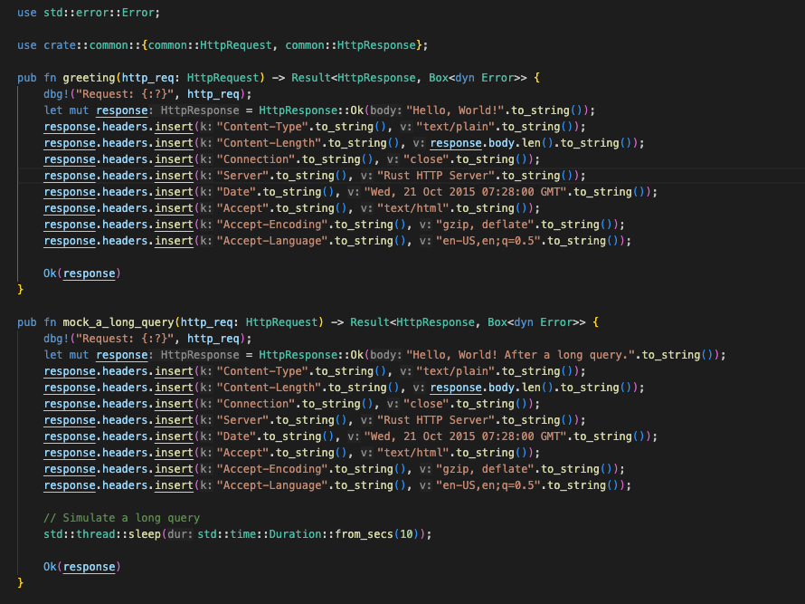
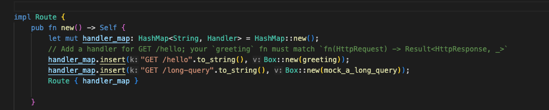

# Dummy Rust HTTP Server

<br>

---

<br>

## Intro

This is a dummy HTTP server implement by Rust, just for practicing Rust language and multi-thread programming.

* Enable multi-thread worker for process HTTP request.
* parse HTTP Request plain text to struct. 
* Implement router for URI path.

<br>

## Project Structure

* [main.rs](src/main.rs)
    * [common](src/common/common.rs)
    * [cp](src/cp/thread_pool.rs)
    * [handler](src/handler/handler.rs)
    * [route](src/route/route.rs)

<br>

### common module

Provide some web project basic struct like `HttpRequest`, `HttpResponse`...

<br>

### cp module

Provide multi-thread workers ability, for async process HTTP request.

<br>

### router module

Mapping URI path to target controller.

<br>

### handler module

Just play the role as Controller in MVC project.

<br>
<br>

## How to code ?

1. Define handler code in handler/handler.rs:
    

<br>

1. Setup route code in route/route.rs:

    

<br>
<br>

## Startup Server

<br>

```cmd
cargo run
```

This dummy server will listen at 127.0.0.1:7878.